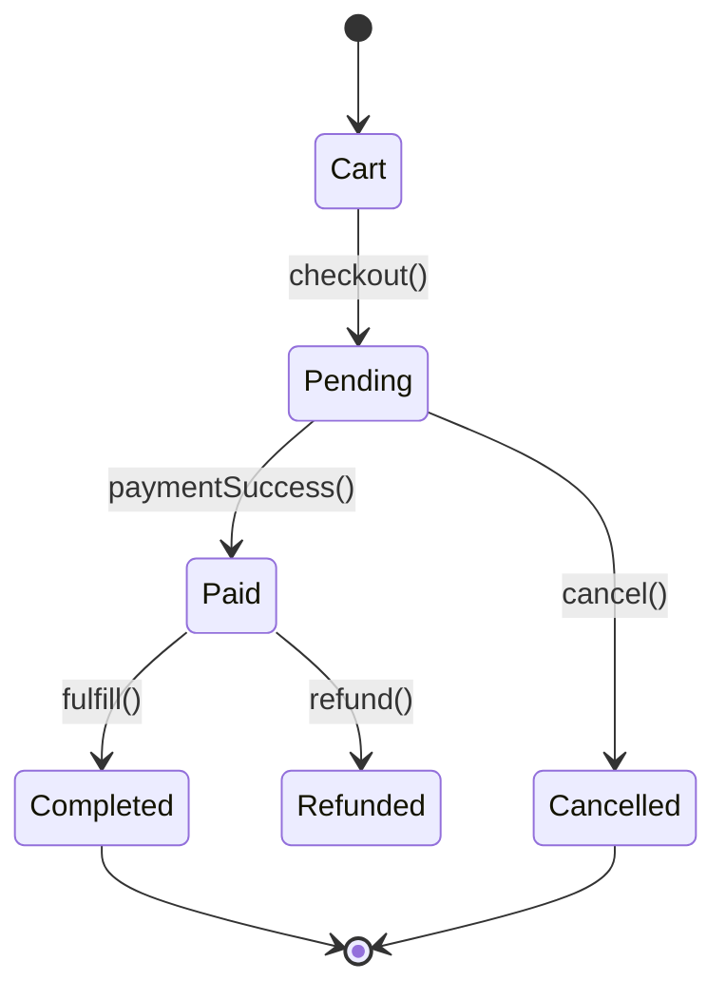

# 🛍️ Laravel E-Commerce MVP


An educational **MVP e-commerce project** built with **Laravel 12 + Sail (Docker)**.  
The goal was to design a scalable, well-structured shop backend with **clean architecture**, **state machines using Enums**, and a **minimal responsive UI** powered by **TailwindCSS**.

> ⚠️ This is a learning project — not a production-ready store.  
> It demonstrates how to structure and implement a real-world Laravel e-commerce backend.

---

## ✨ Features

### 📦 Product Catalog
- Admin CRUD (create, edit, delete products)
- Image upload and stock management  
- Category filtering

### 🛒 Shopping Cart
- Add, update, remove, and clear items  
- Quantity validation with stock limits  
- Session-based cart per user

### 🧾 Checkout Flow
- Snapshotting product data (name + price at the moment of checkout)  
- Customer details and shipping address collection  
- Transactional order creation

### 🔐 Order Lifecycle (Enums)
- `OrderStatus`: Cart → Pending → Paid → Completed → Cancelled  
- `PaymentStatus`: Pending → Paid → Refunded → Failed  
- `ShipmentStatus`: None → Processing → Shipped → Delivered  



### 🧑‍💻 Admin Panel
- View and manage orders  
- Actions: Ship / Deliver / Cancel  
- Protected by **policies** and **authorization guards**

### 💳 Mock Payments
- Simulated payment provider (Success / Fail / Cancel buttons)  
- Fake webhook to update order payment status

### 🎨 Frontend
- Blade templates + TailwindCSS + Vite  
- Clean responsive layout for catalog and orders  
- Basic Alpine.js interactivity

---

## 🛠 Tech Stack

| Layer | Technologies |
|-------|---------------|
| **Backend** | Laravel 12, PHP 8.3 |
| **Frontend** | Blade, TailwindCSS, Alpine.js |
| **Database** | MySQL 8 |
| **Environment** | Laravel Sail (Docker) |
| **Architecture** | Service classes, Enums, Policies, Transactions |
| **Testing** | PHPUnit, Feature tests |

---

## 🚀 Getting Started

### 1️⃣ Clone the repository
```bash
git clone https://github.com/kievski-roman/E-Commerce-Store.git
cd E-Commerce-Store
```

### 2️⃣ Configure environment
```bash
cp .env.example .env
# Edit DB credentials if needed
```

### 3️⃣ Start Docker containers
```bash
./vendor/bin/sail up -d
```

### 4️⃣ Run migrations and seed data
```bash
./vendor/bin/sail artisan migrate --seed
```

> Seeder will create demo products and a test admin user:  
> **Admin login:** admin@example.com  
> **Password:** password

### 5️⃣ Install frontend assets
```bash
./vendor/bin/sail npm install
./vendor/bin/sail npm run dev
```

Then open the app in your browser:
```
http://localhost
```

---

## 🧩 Project Structure
```
app/
 ├── Http/Controllers/       # Controllers for shop and admin
 ├── Models/                 # Models: Product, Order, CartItem, etc.
 ├── Services/               # Business logic (checkout, payment, shipment)
 ├── Enums/                  # State machines (OrderStatus, PaymentStatus…)
 └── Policies/               # Access control
database/
 ├── factories/              # Model factories for seeding
 └── seeders/                # Demo data
```

---

## 🧪 Tests
Run all tests with Sail:
```bash
./vendor/bin/sail artisan test
```
Feature tests cover checkout, cart, and order transitions.

---

## 📘 License
This project is open-sourced under the [MIT License](LICENSE).

---


## 📸 Preview


